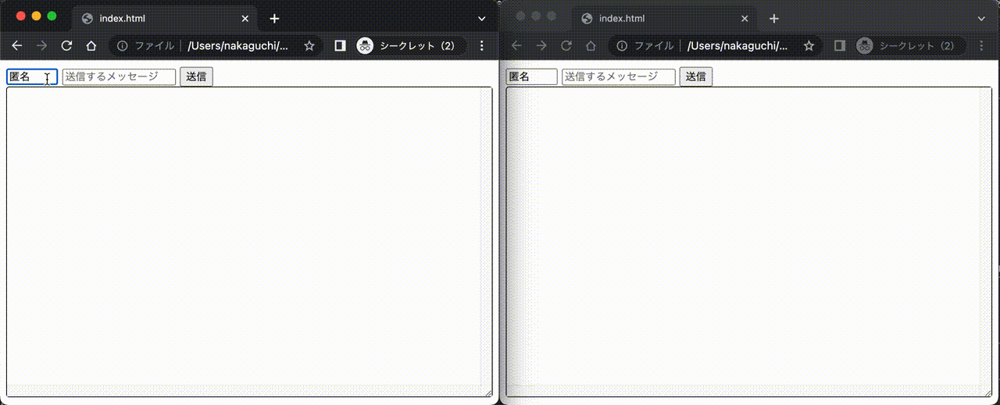
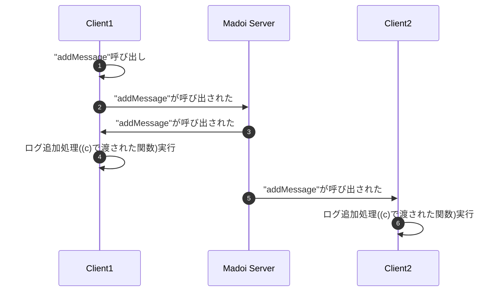
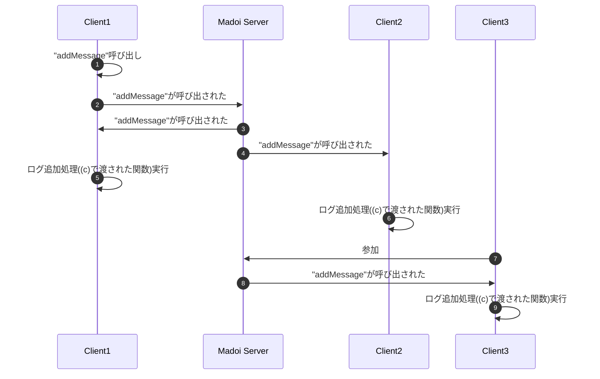

# madoi-sample-chat-react-js

未来環境ラボで開発しているオブジェクト共有サービス Madoi を使ってチャットを作成するサンプルです。ReactJSを使っています。Madoiを利用すると，簡単なコードでチャットやホワイトボードなどのネットワークアプリケーションを開発できます。

サンプルを実行するには，まずこのリポジトリをcloneしてください。
```
git clone https://github.com/kcg-edu-future-lab/madoi-sample-chat-react-js
```

次にindex.htmlをブラウザで開いてください。表示された画面のテキストフィールドにメッセージを入力してEnterを押すか送信ボタンを押すと，チャットメッセージが送信されます。



## コードの説明

このサンプル([ソースコード](https://github.com/kcg-edu-future-lab/madoi-sample-chat-react-js/blob/main/index.html))では，冒頭部分でreactやbabel(reactプログラムをHTML/JSに変換するトランスパイラ)を読み込んでいます。

```html
<script src="https://unpkg.com/react@18/umd/react.production.min.js" crossorigin></script>
<script src="https://unpkg.com/react-dom@18/umd/react-dom.production.min.js" crossorigin></script>
<script src="https://unpkg.com/babel-standalone@6/babel.min.js"></script>
```

これにより，scriptタグにreactプログラムを記述できるようになります。scriptタグでは，ChatFormコンポーネントの定義と，Appコンポーネントの定義を行っています。ChatFromコンポーネントの定義を以下に引用します。

```jsx {.line-number}
const ChatForm = ({onFormSubmit})=>{
    const name = React.useRef();  // (a)
    const message = React.useRef();  // (a)
    const onSubmit = e=>{  // (b)
        e.preventDefault();
        const n = name.current.value.trim();
        const m = message.current.value.trim();
        if(m.length > 0){
            onFormSubmit(n, m);  // (c)
            message.current.value = "";
        }
    };
    return (
        <form onSubmit={onSubmit}>
            <input ref={name} size="6" defaultValue="匿名"></input>
            <input ref={message} size="24" placeholder="メッセージ"></input>
            <button>送信</button>
        </form>
    );
};
```

ChatFormコンポーネントは，onFormSubmitメソッドを受け取り，inputタグにアクセスするための参照(useRef)を定義し`(a)`，フォームのonSubmitイベントを受け取るonSubmitメソッドを定義しています`(b)`。

参照はReactの機能で，参照を格納した変数を，参照するタグのref属性に設定しておけば，コード内でそのタグを操作することができます。onSubmitメソッドで，この参照を使い，名前とメッセージを入力するinputタグから入力された値を取り出し，onFormSubmitメソッドに渡しています`(c)`。

最後に，Appコンポーネントを定義して，ChatFormコンポーネントやMadoiを利用して，チャットアプリケーションを作成します。以下にコードを引用します。

```jsx
const App = () => {
    const log = React.useRef();  // (a)
    const m = new madoi.Madoi("chat-lbnsek2w");  // (b)
    const addMessage = m.registerFunction((name, message)=>{  // (c)
        const p = document.createElement("div");
        ReactDOM.createRoot(p).render(
            <div><b>{name}</b>: <span>{message}</span></div>
        );
        log.current.append(p);
    }, {maxLog: 1000});
    return (
        <div>
            <ChatForm onFormSubmit={addMessage} />  // (d)
            <div ref={log} id="chatLogDiv">  // (e)
            </div>
        </div>
    );
};
ReactDOM.createRoot(document.getElementById("root")).render(<App />);
```

Appコンポーネントでは，最初にログを表示するdivタグを参照するための定義`(a)`をおこなっています。ここで作成した参照は，ログ用のdivタグで使用しています`(e)`。

次にMadoiを作成しています`(b)`。Madoiクラスをnewすると，Madoiサーバへの接続が開始されます。次にMadoiに対して`registerFunction`メソッドを呼び出して関数を登録しています`(c)`。この関数は，nameとmessageを受け取り，1行分のログを表示するHTMLを生成し，ログ用のdivタグに追加しています。最後にregisterFunctionメソッドの戻り値をaddMessage変数に代入し，それをChatFormのonFormSubmit属性に指定しています`(d)`。ChatFormコンポーネントでは，送信ボタンが押された際にnameとmessageがonFormSubmitに指定された関数に渡されます。Madoiはこれをサーバに通知します。サーバが通知を受け取ると全てのクライアントにその通知が送信されます。クライアントが通知を受け取ると，実際の関数(registerFunctionに渡された関数)が実行されます。



この仕組みにより，チャットログの追加処理が共有され，チャットアプリケーションが実現できます。また，`(c)`でregisterFunctionを呼び出した際に，2番目の引数として，`{maxLog: 1000}`を渡しています。これは，1番目の引数に渡された関数の実行をサーバ側に1,000件記録するという指定で，新しいクライアントが参加してきた時に，その記録が渡されます。この仕組みにより，途中からクライアントが参加しても，チャットログの状態が最新に追いつきます。


